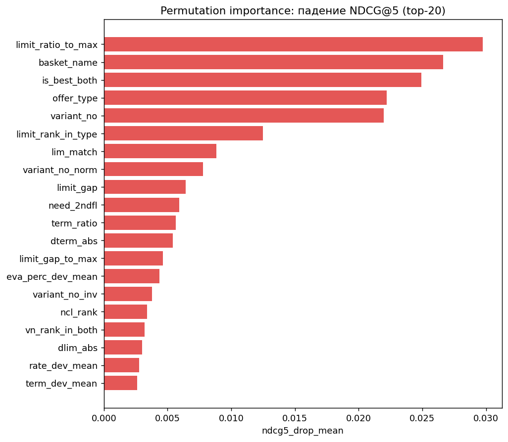
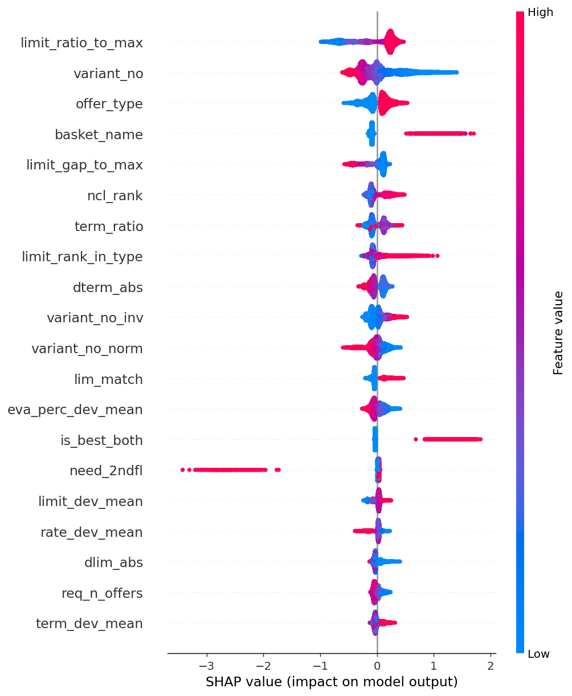
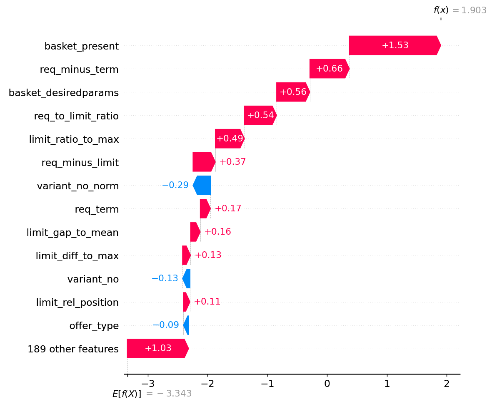

# Alfa Credit Offer Ranking

[](https://github.com/jmihan/alfa_hack_cred/actions/workflows/tests.yml)

Решение задачи «Прогноз кредита по клиентам» хакатона Альфа-Банка
(Яндекс Контест). Цель — ранжировать кредитные предложения внутри
каждого запроса клиента так, чтобы максимизировать метрику **NDCG@5**.

## Постановка

Для каждого запроса `request_id` дано до 50 кредитных предложений
(`variant_no`). Нужно выдать `score` для каждой пары
`(request_id, variant_no)`, по которому предложения внутри запроса
ранжируются. Качество — средний NDCG@5 по запросам. На лидерборде
метрика умножается на 100.

Формат сабмита (`commit.csv`, разделитель `;`):

```
request_id;variant_no;score
0;10;0.016394
...
```

## Результаты

Стартовая планка организаторов — RandomForest c NDCG@5 ≈ 0.57 на train
(на LB не сабмитили). Простая эвристика «pil1mtrx_offer первыми +
variant_no asc» уже даёт NDCG@5 ≈ 0.80 на train.

| Этап | LB |
|------|----|
| LGBM LambdaRank baseline | 91.634 |
| LGBM Optuna tuned | 91.7512 |
| LGBM extended features | 91.8648 |
| Сильнейшая одиночка (lgbm_boot_v_s256) | 91.8774 |
| blend 11 моделей (record_11) | 91.9668 |
| two-stage прорыв (Pipeline K, B-only XGB) | 91.9939 |
| two-stage + bBalanced (12 B-моделей) | 92.0317 |
| two-stage + bBalanced + pseudo + crossobj | 92.0504 |
| + фича `is_best_both` (9-модельный B-бленд) | 92.1359 |
| широкий offer-набор + 8-модельный B-бленд | ≈ 92.18 |
| + pointwise-MLP диверсити в B-бленд (`0.70·b_blend + 0.30·MLP`) | **≈ 92.19** ← финал |

> Точное воспроизведение рекорда — режим **`reproduce`**: детерминированно (на любой
> машине, GPU не нужен, ~2 мин) собирает **байт-в-байт** сабмит с LB **92.1957** из
> зафиксированных предсказаний рекорда (`artifacts/record/`) и сверяет sha256.
> Режим **`train`** обучает близкий пайплайн с нуля — **≈ 92.19** (Ryzen 5 7500F, CPU:
> 92.1918). A-база рекорда (11-модельный бленд `record_11`) и нейросеть не
> переобучаются бит-в-бит на другом железе и между версиями torch (метрика плавает
> в пределах ~±0.002), поэтому ровно 92.1957 гарантирует именно `reproduce`.
> NDCG@5 зависит только от порядка офферов.

Два рычага финальной фазы:

1. Фича **`is_best_both`** — оффер, точно совпадающий с заявкой клиента
   (`limit == req_loan_amount` И `term == req_term`) и первый среди таких по
   `variant_no`. Deal-rate ≈ **52%** против ≈2.8% — «мягкий» hard-rule для подзадачи B.
2. **Pointwise-MLP** как ортогональная диверсити к GBDT-бленду. Бустинги в B-бленде
   архитектурно близки; нейросеть `P(is_deal)` (Spearman ≈ 0.84 с `b_blend`) даёт
   диверсити другой природы — её добавление (вес 0.30) дало **+0.018 LB**.

## Архитектура решения

EDA показала, что задача распадается на две неравные части по флагу
`pil1mtrx_offer`. Рекордное решение эксплуатирует это напрямую (two-stage):

```
                          test (936 883 строк, 38 742 запроса)
                                       │
                  ┌────────────────────┴────────────────────┐
                  │                                         │
       подзадача A (≈66% запросов)              подзадача B (≈34% запросов)
       в группе есть pil1mtrx_offer=1            pil1mtrx-флага нет
                  │                                         │
                  ▼                                         ▼
       5-модельный A-бленд                      0.70·b_blend + 0.30·pointwise-MLP
       (3×LGBM + 2×CatBoost)                    b_blend: 8 GBDT (LGBM×3+XGB×3+CB×2),
       + hard-rule: pil1 → верх                 MLP: нейросеть P(is_deal) (диверсити),
                  │                              широкий offer-набор (361 фича)
                  │                                         │
                  └────────────────┬────────────────────────┘
                                   │
                                   ▼
                              финальный сабмит
                                LB ≈ 92.19
```

**Подзадача A** решается hard-rule (`pil1mtrx_offer=1` → первое место; такой
оффер становится сделкой в 99.7% случаев) поверх rank-avg 5-модельного A-бленда
([`models/a_blend.py`](src/alfa_cred/models/a_blend.py)): 3×LightGBM extended +
2×CatBoost YetiRank на расширенном наборе ([`build_feature_table`](src/alfa_cred/features/pipeline.py)).

**Подзадача B** (заявки без pil1-оффера) — реальная задача ранжирования. Её скор —
смесь `0.70·b_blend + 0.30·MLP` (перцентильные ранги):

- **`b_blend`** ([`models/b_blend.py`](src/alfa_cred/models/b_blend.py)) — 8 GBDT:
  LightGBM LambdaRank ×3 + XGBoost rank:ndcg ×3 + CatBoost YetiRank ×2 на широком
  offer-наборе ([`build_wide_feature_table`](src/alfa_cred/features/pipeline.py)):
  внутригрупповые ранги (см. [`features/group.py`](src/alfa_cred/features/group.py)),
  кросс-офферные сравнения, Парето, ask-match стек с **`is_best_both`**
  ([`features/match.py`](src/alfa_cred/features/match.py)).
- **pointwise-MLP** ([`models/mlp_pointwise.py`](src/alfa_cred/models/mlp_pointwise.py)) —
  детерминированная нейросеть `P(is_deal)` (эмбеддинги категориальных + числовые).
  Ортогональна деревьям (Spearman ≈ 0.84 с `b_blend`), поэтому добавляет диверсити
  другой природы.

Сборка обеих стадий — в [`two_stage.py`](src/alfa_cred/two_stage.py). Доступны три
режима (см. «Запуск в Docker»): `reproduce` — байт-в-байт рекорд 92.1957 из
зафиксированных предсказаний; `train` — обучить весь пайплайн с нуля и сохранить
модели; `inference` — собрать сабмит из сохранённых моделей.

Полная хронология экспериментов (все pipeline-ы, CV/LB каждого сабмита,
гиперпараметры, что сработало и что нет) — в [`EXPERIMENTS.md`](EXPERIMENTS.md).
EDA-выводы — в [`notebooks/EDA_FINDINGS.md`](notebooks/EDA_FINDINGS.md).

## Что конкретно в финальном решении

### Признаки

Две feature-таблицы (обе детерминированы из pre-decision атрибутов, не лик):

- **Расширенный набор для A** ([`build_feature_table`](src/alfa_cred/features/pipeline.py),
  ~212 фич): внутригрупповые ранги / z-scores / агрегаты по `request_id`
  ([`features/group.py`](src/alfa_cred/features/group.py)), ранги внутри подгрупп
  `offer_type`/`risk_level_map`, кросс-фичи оффер×заявка, basket multi-hot
  ([`features/basket.py`](src/alfa_cred/features/basket.py)), временные из
  `request_received` ([`features/time.py`](src/alfa_cred/features/time.py)),
  клиентские из `features_small.pq` с фильтром по заполненности
  ([`features/client.py`](src/alfa_cred/features/client.py)), ask-match + Парето.
- **Широкий offer-набор для B** ([`build_wide_feature_table`](src/alfa_cred/features/pipeline.py),
  361 фича): клиентские мерджатся целиком (минус `*_date`); расширенные min-max /
  dev / перцентильные ранги, кросс-офферные сравнения внутри типа и уровня риска
  (`*_rank_in_type`, `*_rank_in_risk`, `*_share_lower/better`), Парето-доминирование,
  индикаторы `is_lowest_rate`/`is_highest_eva`/`is_max_limit`, ask-match стек.

**Ключевая фича — `is_best_both`** ([`features/match.py`](src/alfa_cred/features/match.py)):
оффер с `limit==req_loan_amount` И `term==req_term`, первый по `variant_no` среди
таких. Deal-rate ≈ 52% (vs ≈2.8% базы). GBDT не строит этот трёхуровневый композит
дёшево из непрерывных разниц — его подаём явной фичей.

### Модели и гиперпараметры

**A-бленд** (5 моделей, rank-avg перцентильных рангов; [`models/a_blend.py`](src/alfa_cred/models/a_blend.py)):

- 3× LightGBM LambdaRank (сиды 42/123/777): `learning_rate=0.0138`, `num_leaves=374`,
  `min_data_in_leaf=388`, `feature_fraction=0.78`, `bagging_fraction=0.89`,
  `bagging_freq=5`, `lambda_l1=5e-4`, `lambda_l2=7e-5`, `min_gain_to_split=0.013`,
  `n_estimators=2500`.
- 2× CatBoost YetiRank (сиды 42/123): `learning_rate=0.05`, `depth=6`,
  `l2_leaf_reg=3.0`, `bootstrap_type=Bernoulli`, `subsample=0.85`, `iterations=1000`.

**B-бленд** (8 моделей, rank-avg; [`models/b_blend.py`](src/alfa_cred/models/b_blend.py)):

- 3× LightGBM LambdaRank (сиды 42/123/7): `learning_rate=0.03`, `num_leaves=31`,
  `min_child_samples=40`, `feature_fraction=0.7`, `bagging_fraction=0.8`,
  `lambdarank_truncation_level=5`, `lambda_l2=1.0`, `n_estimators=500`.
- 3× XGBoost `rank:ndcg` (сиды 42/137/314): `learning_rate=0.03`, `max_depth=6`,
  `subsample=0.8`, `colsample_bytree=0.7`, `reg_lambda=1.0`, `n_estimators=500`.
- 2× CatBoost YetiRank (сиды 42/777): `learning_rate=0.05`, `depth=8`,
  `l2_leaf_reg=3.0`, `iterations=500`.

**Pointwise-MLP** ([`models/mlp_pointwise.py`](src/alfa_cred/models/mlp_pointwise.py)):
эмбеддинги категориальных + стандартизованные числовые → MLP `[256, 128]`
(ReLU + BatchNorm + Dropout 0.15) → сигмоида `P(is_deal)`. `Adam(lr=1e-3,
weight_decay=1e-5)`, BCE, 18 эпох, batch 4096, усреднение по сидам 42/137/314.

**Сборка B-стороны:** `0.70·rank(b_blend) + 0.30·rank(MLP)`. A-сторона — rank-avg
A-бленда + hard-rule (`pil1mtrx=1` → +1.0, гарантирует первое место).

### Подходы, соображения, инструменты

- **Two-stage по `pil1mtrx_offer`** — главный рычаг: задача распадается на A (есть
  pil1, hard-rule почти решает) и B (реальный LTR). B-модели обучаются ТОЛЬКО на
  B-заявках — не тратят ёмкость на структуру A.
- **Rank-averaging** (перцентильные ранги внутри заявки) — устойчив к разным
  шкалам моделей, лучше усреднения сырых скоров.
- **Ортогональная диверсити нейросетью**: GBDT-бленд однороден (деревья); MLP даёт
  ранги со Spearman ≈ 0.84 к `b_blend` → его подмешивание дало +0.018 LB.
- **CV не предсказывает LB точно** — главная методологическая особенность: прирост
  от диверсити почти не виден в OOF, но значим на LB. Доверяем LB как ground truth,
  CV — для отсечки моделей ниже эмпирической границы 0.913.
- **Детерминизм**: фиксированные сиды всех моделей + `cudnn.deterministic` для MLP.
- **Инструменты**: LightGBM 4.4, XGBoost 2.0, CatBoost 1.2, PyTorch 2.3, MLflow
  (трекинг CV-экспериментов), Optuna (тюнинг), SHAP (интерпретация), Docker
  (воспроизведение с нуля).

## Структура репозитория

```
.
├── data/                          # исходные данные (gitignored)
├── task/                          # условие задачи (gitignored)
├── src/alfa_cred/                 # переиспользуемый код
│   ├── config.py                  # пути и константы
│   ├── io_utils.py                # загрузка/мёрж parquet, кодирование cat-фич
│   ├── metrics.py                 # NDCG@5
│   ├── validation.py              # CV-сплиттеры (GroupKFold / time-split)
│   ├── inference.py               # формирование сабмита + hard-rule
│   ├── two_stage.py               # подготовка признаков A/B + сборка сабмита (train+inference)
│   ├── interpret.py               # SHAP + group-aware permutation важность
│   ├── features/                  # инженерия признаков
│   │   ├── basic.py / group.py    # базовые и внутригрупповые признаки оффера
│   │   ├── match.py               # ask-match признаки + is_best_both + Парето
│   │   └── pipeline.py            # сборка feature-таблиц (build_feature_table / build_wide_feature_table)
│   ├── models/                    # модели
│   │   ├── a_blend.py             # A-бленд (3×LGBM + 2×CatBoost)
│   │   ├── b_blend.py             # 8-модельный B-бленд (LGB×3+XGB×3+CB×2)
│   │   └── mlp_pointwise.py       # детерминированный pointwise-MLP (диверсити B)
│   ├── training.py                # обучающий цикл с MLflow (эксперименты)
│   ├── tuning.py                  # Optuna для гиперпараметров
│   ├── tracking.py                # обёртки MLflow
│   └── utils.py                   # логгер, seed_everything
├── notebooks/
│   ├── 01_eda.ipynb               # EDA, базовая визуализация
│   ├── EDA_FINDINGS.md            # выжимка по EDA
│   └── INTERPRETATION.md          # выводы по интерпретации модели
├── scripts/
│   ├── reproduce_record.py        # REPRODUCE: байт-в-байт рекорд 92.1957 из artifacts/record
│   ├── fit_pipeline.py            # TRAIN: обучить весь пайплайн с нуля + сохранить модели (LB ≈ 92.19)
│   ├── predict.py                 # INFERENCE: сабмит из сохранённых моделей
│   ├── train.py                   # CV одиночной модели по YAML-конфигу (эксперименты)
│   ├── tune.py                    # Optuna для LightGBM
│   ├── explain.py                 # SHAP + permutation интерпретация B-модели
│   └── verify_submission.py       # сверка двух сабмитов по ранжированию (top-1)
├── tests/                         # юнит-тесты: NDCG@5, формат сабмита, is_best_both
├── artifacts/record/              # зафиксированные предсказания рекорда (для reproduce, ~9 МБ, в git)
├── docs/img/                      # графики интерпретации для README
├── configs/                       # YAML-конфиги экспериментов
├── models/                        # обученные модели (gitignored; train -> inference)
├── submissions/                   # сабмиты (gitignored)
├── oof/                           # OOF и test_scores (gitignored)
├── mlruns/                        # MLflow runs (gitignored)
├── Dockerfile                     # CPU-образ (reproduce/inference/train/cv/interpret)
├── Dockerfile.gpu                 # GPU-образ для train-gpu (XGBoost/CatBoost/MLP на GPU)
├── docker-compose.yml             # режимы запуска
├── run.sh                         # единая точка запуска (reproduce/train/.../test)
├── EXPERIMENTS.md                 # лог экспериментов
├── README.md                      # этот файл
├── requirements.txt
└── pyproject.toml
```

## Окружение

- Python **3.11** (pyenv-win), изолированный `.venv` в корне.
- Зависимости пинятся в `requirements.txt`. Сам пакет ставится
  редактируемым: `pip install -e .`.
- GPU — RTX 3060 Ti 8 GB. CatBoost и XGBoost запускались на GPU,
  LightGBM по умолчанию на CPU (GPU-сборка не давала прироста на
  наших размерах).
- Все эксперименты помещаются в 32 GB RAM при разумном downcast-е
  (int32/float32).

## Установка

```powershell
# PowerShell (Windows)
py -3.11 -m venv .venv
.\.venv\Scripts\Activate.ps1
python -m pip install --upgrade pip
pip install -r requirements.txt
pip install -e .
```

```bash
# bash
python3.11 -m venv .venv
source .venv/Scripts/activate
python -m pip install --upgrade pip
pip install -r requirements.txt
pip install -e .
```

Данные положите в `data/`:
- `train_dataset_small.pq`
- `test_dataset_small.pq`
- `features_small.pq`
- `feature_description.csv`
- `commit.csv` (пример сабмита)

## Запуск в Docker

Быстрый старт одной командой (соберёт образ и воспроизведёт рекорд):

```bash
./run.sh                 # = собрать образ + reproduce (LB 92.1957); см. ./run.sh train|inference|interpret|test
```

Под капотом — CPU-образ ([`Dockerfile`](Dockerfile)): Python 3.11 + зависимости + пакет
(`pip install -e .`, torch — CPU-сборка) и зафиксированные предсказания рекорда
(`artifacts/record`) внутри. Данные монтируются как volume (`./data`, `./models`,
`./submissions`, ...). У каждого режима свой профиль, поэтому образ собираем обычным
`docker build`, а режимы запускаем через `run --rm` (см. [`docker-compose.yml`](docker-compose.yml)):

```powershell
docker build -t alfa-cred:latest .       # собрать образ (за VPN: добавьте --network=host)

docker compose run --rm reproduce        # БАЙТ-В-БАЙТ рекорд (LB 92.1957) из artifacts/record (~2 мин, GPU не нужен)
docker compose run --rm train            # обучить весь пайплайн с нуля + сохранить ./models + сабмит (LB ≈ 92.19)
docker compose run --rm inference        # быстрая пересборка сабмита из ./models (без обучения)

docker compose run --rm cv               # CV одиночной модели по YAML-конфигу (эксперименты, логи в ./mlruns)
docker compose run --rm interpret        # SHAP + permutation (графики/CSV в ./reports/interpretation)
docker compose --profile mlflow up       # MLflow UI -> открыть http://localhost:5000 (только UI; Ctrl+C — остановить)
```

Организаторам достаточно положить данные в `./data` и собрать образ. Для **точного
рекорда** — `docker compose run --rm reproduce` (детерминированно, на любой машине,
ровно 92.1957, со сверкой sha256). Для **обучения с нуля** — `docker compose run --rm
train` (LB ≈ 92.19). Оба пишут сабмит в `./submissions/record_submission.csv`.
Сабмит пишется с фиксированным переводом строки (CRLF), поэтому байты совпадают на
Windows и Linux — `reproduce` даёт одинаковый sha везде.

**Время по этапам** (Ryzen 5 7500F, CPU; ориентир):

| Режим | Время |
|-------|-------|
| `reproduce` (сборка из артефактов + sha256) | ≈ 2 мин |
| `train` (A-бленд 5 + b_blend 8 + MLP 3, с нуля) | ≈ 55 мин (из них A-бленд ≈ 45 мин) |
| `inference` (загрузка моделей + сборка сабмита) | ≈ 5 мин |
| `cv` (одна LightGBM, 5-fold) | ≈ 25 мин |
| `interpret` (обучение reference-модели + SHAP + permutation) | ≈ 2 мин |

> MLflow UI открывать по `http://localhost:5000` (не `0.0.0.0` — внутри контейнера
> сервер слушает `0.0.0.0:5000`, а наружу проброшен на localhost хоста).

**GPU (опционально, для `train`).** Отдельный образ [`Dockerfile.gpu`](Dockerfile.gpu)
(torch cu121) и сервис `train-gpu` обучают на GPU XGBoost (`device='cuda'`), CatBoost
(`task_type='GPU'`) и MLP; LightGBM остаётся на CPU (как весь хакатон). Нужен
nvidia-container-toolkit на хосте:

```powershell
docker compose --profile gpu build train-gpu
docker compose --profile gpu run --rm train-gpu
```

GPU-обучение деревьев даёт другие числа, чем CPU, поэтому `train-gpu` тоже не
байт-в-байт; точный рекорд — только `reproduce`.

**За корпоративным VPN/файрволом.** Если сборка падает с SSL-ошибкой при доступе
к pypi (`SSL: UNEXPECTED_EOF_WHILE_READING`), соберите образ через host-сеть и
дальше запускайте сервисы как обычно (compose возьмёт готовый `alfa-cred:latest`):

```powershell
docker build --network=host -t alfa-cred:latest .
docker compose run --rm reproduce
```

## Воспроизведение сабмитов

### Точный рекорд (LB 92.1957) — байт-в-байт

`reproduce_record.py` собирает рекордный сабмит из зафиксированных предсказаний в
[`artifacts/record/`](artifacts/record) и сверяет sha256 с эталоном:

```powershell
python scripts/reproduce_record.py --out submissions/record_submission.csv
```

Состав (двухстадийно по `pil1mtrx_offer`): A-сторона — ранжирование A-бленда
`record_11` (11 моделей, агрегат большого числа прогонов); B-сторона —
`0.70·rank(b_blend) + 0.30·rank(MLP)`. Порядок строк берётся из самих данных
(`load_raw` → `sort_by_request`), поэтому сабмит маппится на актуальный test.
Детерминированно на любой машине (GPU не нужен) — это и есть гарантия 92.1957.
A-база `record_11` и нейросеть невоспроизводимы побайтно переобучением на другом
железе, поэтому их предсказания и зафиксированы как артефакты (~9 МБ в git).

### Обучение с нуля (LB ≈ 92.19)

Близкий к рекорду пайплайн, обучаемый полностью с нуля; разделён на два шага:

```powershell
# TRAIN: обучить все модели (A-бленд 5 + b_blend 8 + MLP 3) и сохранить в ./models (~55 мин)
python scripts/fit_pipeline.py --out submissions/record_submission.csv

# INFERENCE: быстрая пересборка сабмита из сохранённых моделей (без обучения)
python scripts/predict.py --out submissions/record_submission.csv
```

`fit_pipeline.py` обучает A-бленд (3×LGBM + 2×CatBoost), B-бленд (LGB×3+XGB×3+CB×2)
и pointwise-MLP, сохраняет их в `models/` и пишет сабмит. Дальше `predict.py`
собирает сабмит из этих моделей без переобучения. Главный сигнал подзадачи B —
фича `is_best_both` (deal-rate ≈ 52%) + ортогональная MLP-диверсити. На GPU
(XGBoost/CatBoost/MLP) — через `--device cuda` или образ `Dockerfile.gpu`.

> NDCG@5 зависит только от порядка офферов, поэтому обучение с нуля воспроизводит
> LB-скор около 92.19; побитовое равенство файла между машинами не гарантируется
> (многопоточность GBDT/NN). Для ровно 92.1957 используйте `reproduce`.

### Готовые веса (опционально)

Чтобы пропустить 55-минутное обучение и сразу собрать сабмит через `inference`,
можно скачать предобученные модели (A-бленд 5 + b_blend 8 + MLP) и распаковать их
в `./models/`:

- **Скачать (Google Drive):** `<ВСТАВИТЬ ССЫЛКУ>`
- Распаковать архив в `./models/` (файлы `a_*`, `b_*`, `mlp_pointwise.pt`, манифесты).
- Собрать сабмит: `docker compose run --rm inference` (или `python scripts/predict.py`).

Эти веса дают результат обучения с нуля (**LB ≈ 92.19**). Для **точного рекорда
92.1957** готовые веса не нужны — он воспроизводится из `artifacts/record/` (уже в
репозитории) режимом `reproduce`.

Сверка ранжирования двух сабмитов (например train- и reproduce-сборки):

```powershell
python scripts/predict.py --out submissions/check.csv
python scripts/verify_submission.py submissions/check.csv submissions/record_submission.csv
```

## Интерпретация модели

Драйверы скоринга подзадачи B разбираются двумя взаимодополняющими методами —
**SHAP TreeExplainer** (аддитивные вклады в скор оффера) и **group-aware
permutation importance на NDCG@5** (модель-агностично, устойчиво к коррелированным
признакам). Объясняется **рекордная B-модель**: одиночная LightGBM с теми же
гиперпараметрами (`LGB_B_PARAMS`), сидом (42) и широким offer-набором, что и член
`b_blend` (SHAP применим к одному дереву, а не к rank-avg 8 моделей + MLP; сигнал у
всех членов общий). Реализация — [`src/alfa_cred/interpret.py`](src/alfa_cred/interpret.py).

```powershell
python scripts/explain.py            # или: docker compose run --rm interpret
```

**Главный вывод:** `is_best_both` — **top-3 драйвер NDCG@5** по permutation, хотя по
среднему |SHAP| лишь 14-й: признак разреженный (≈2.4% офферов), поэтому средняя
магнитуда размывается, но там, где он срабатывает, его вклад в ранжирование решающий.
Это согласуется с абляцией (+0.0063 B-NDCG@5, LB 92.05 → 92.18) — фича несёт
уникальный, неперекрываемый сигнал.

Permutation importance (падение NDCG@5 при перемешивании признака, valid-сплит B,
base NDCG@5 = 0.7522):

| Признак | Падение NDCG@5 |
|---------|----------------|
| `limit_ratio_to_max` | 0.0305 |
| `basket_name` | 0.0280 |
| **`is_best_both`** | **0.0258** |
| `offer_type` | 0.0222 |
| `variant_no` | 0.0204 |
| `limit_rank_in_type` | 0.0126 |
| `lim_match` | 0.0108 |



SHAP beeswarm (направление и величина вклада признаков в скор оффера):



Локальное объяснение (waterfall) одного `is_best_both`-оффера, ставшего сделкой —
видно, как именно признаки складываются в итоговый скор для конкретного оффера:



Полный набор графиков (beeswarm, bar, dependence по `is_best_both`, локальные
waterfall) и CSV-таблицы пишутся в `reports/interpretation/` при запуске `explain.py`.

## Тесты

Юнит-тесты ([`tests/`](tests)) проверяют то, что должно быть верно при любых
изменениях: корректность метрики **NDCG@5** (по ней принимаются все решения), формат
и побайтную детерминированность сабмита (CRLF, округление до 6 знаков, сверка ключей)
и логику ключевой фичи **`is_best_both`**. Данные хакатона не нужны — тесты на
синтетике, запускаются где угодно.

```powershell
pytest            # или: ./run.sh test
```

## Запуск экспериментов

```powershell
# обучение и CV по YAML-конфигу
python scripts/train.py --config configs/baseline_lgbm.yaml

# тюнинг LightGBM через Optuna
python scripts/tune.py \
    --config configs/lgbm_optuna.yaml \
    --out configs/lgbm_optuna_tuned.yaml \
    --n-trials 30

# MLflow UI для просмотра прогонов
mlflow ui --backend-store-uri mlruns/
```

## Ключевые инсайты

1. **Двухсегментная природа задачи** (через `pil1mtrx_offer`) — главный
   рычаг. EDA-эвристика «pil1mtrx первыми» уже даёт NDCG@5 ≈ 0.80 на
   train. Финальный прирост этого подхода через two-stage блендинг —
   +0.027 LB от плоского blend record_11.
2. **B-only обучение** на 34% запросов выигрывает у моделей, обученных
   на всём train, для подзадачи B. Видимо, потому что общая модель
   тратит ёмкость на структуру подзадачи A.
3. **Multi-seed одного и того же XGB** даёт +0.024 от одиночной модели.
   Bootstrap-вариативность гораздо устойчивее, чем глубокий Optuna-тюнинг.
4. **bBalanced (top-3 каждого типа архитектуры)** — оптимальный размер
   B-blend в 12-16 моделей. Больше моделей размывают результат, меньше
   теряют диверсификацию.
5. **Cross-objective диверсификация** (`xgb_pairwise`, `lgbm_xendcg`)
   и **pseudo-labeling** — добавляют ~+0.004 каждый в небольшой blend.
6. **CV не предсказывает LB точно**: модели с CV 0.916 и CV 0.918 могут
   меняться местами на LB. Доверяем LB как ground truth, а CV — только
   для отсечки моделей ниже эмпирической границы.
7. **`is_best_both` — главный сигнал подзадачи B.** Композит «точное
   совпадение суммы И срока И первый по `variant_no`» GBDT не строит дёшево
   из непрерывных разниц — его нужно подавать явной фичей. Контролируемая
   абляция в полном бленде: +0.0063 B-NDCG@5; на LB — рывок 92.05 → 92.18.
   Эффект значим только в бленде, не в одиночной модели.

## Что не сработало

Подробности — в [`EXPERIMENTS.md`](EXPERIMENTS.md). Кратко:

- Tabular DL (FT-Transformer, TabNet) — слабее GBM в одиночку и
  «размывают» blend.
- Customer history features — мало пересечений `app_id` train/test.
- Per-epoch модели — CV завышен на сабсете, LB катастрофический.
- Глубокий Optuna для XGBoost — переобучение, LB хуже дефолтных
  параметров.
- Pairwise binary classification (tournament) — не работает на нашей
  постановке.
- Subgroup specialization по `offer_type` — только как ДОПОЛНЕНИЕ,
  не как замена.
- Hybrid 50/50 (полусмешивание record и B-only) — чистый replacement
  лучше.
- LB-weighted blend — uniform даёт стабильнее.
- AutoEncoder embeddings и MI scan на 280 фичах — «скрытого сигнала»
  не нашёл; топ-MI ~0.06 в шуме.

## Метрика

Реализация NDCG@5 в [`src/alfa_cred/metrics.py`](src/alfa_cred/metrics.py)
сверена с baseline-оценкой организаторов. Для B-only моделей есть
отдельный хелпер `compute_b_ndcg5`, отфильтровывающий запросы
подзадачи A (там NDCG@5 ≈ 1.0 за счёт hard-rule и она «скрывает»
реальный прирост на подзадаче B).
